> Universidad de San Carlos de Guatemala    
> Facultad de Ingeniería  
> Escuela de Ciencias y Sistemas  
> Arquitectura de computadores y ensambladores 1  
> Segundo Semestre  
> Ing. Otto Rene Escobar Leiva  
> Tutor Académico Oscar Peralta  

> Integrantes:  
> 1. Nombre 1 - Carnet
> 2. Nombre 2 - Carnet
> 3. Nombre 3 - Carnet
> 4. Nombre 4 - Carnet
> 5. Nombre 5 - Carnet

# **PRACTICA 1**

## DESCRIPCIÓN DE LA PRÁCTICA

La presente práctica tiene como finalidad el desarrollar una variación del juego Tetris simulada en proteus. El cual consiste en la generación aleatoria de diferentes bloques que aparecen en la parte derecha de la pantalla, los cuales se van apilando y se van acumulando puntos por completar, en este caso, columnas llenas de ocho bloques.

El juego se visualiza por medio de una pantalla compuesta por dos matrices led de 8x8 orientadas de forma horizontal (dando el aspecto de una matriz led de 8x16) y es controlado por cuatro botones con diferentes funciones (que se detallan posteriormente) y mediante los cuales se puede mover un bloque de arriba hacia abajo, rotar el bloque, entre otras funciones. Es posible visualizar un mensaje que muestra la información del grupo que desarrolló la solución; además, que lleva un control de los puntos acumulados, así como también la siguiente pieza que se mostrará en la pantalla mediante un menú.

Adicional a lo anterior, a los bloques que son generados se les puede modificar la velocidad de desplazamiento, esto, manipulando un potenciómetro.

## DISEÑO

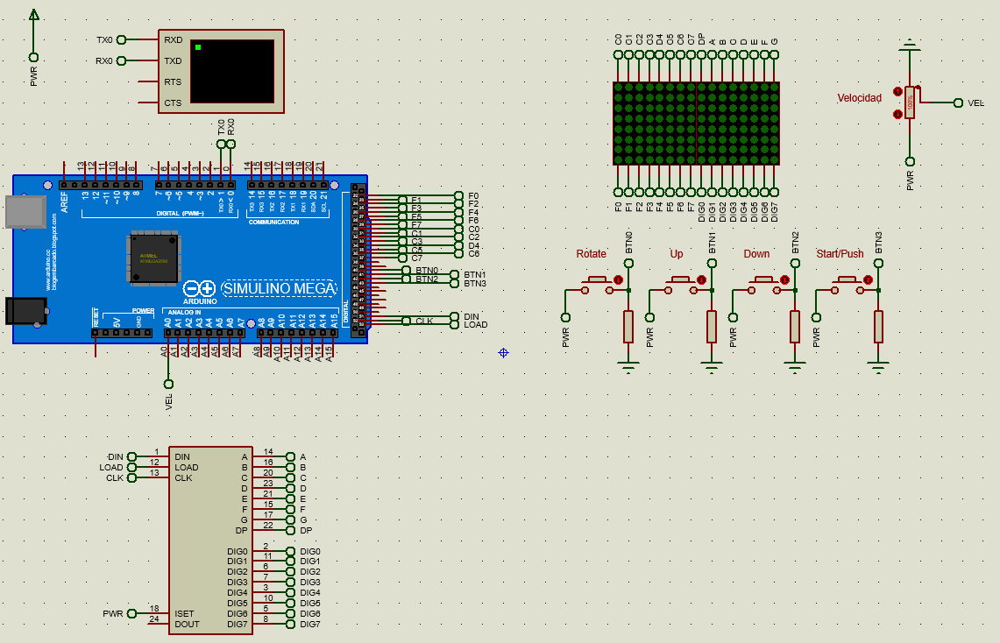

## FLUJO DEL PROGRAMA

### **Mensaje Inicial**
Mensaje inicial: al inicializar el dispositivo Arduino, se genera un mensaje con datos del grupo que creó la solución, específicamente el mensaje: *“^PRAC1-GRUPO12-SECC A^”*

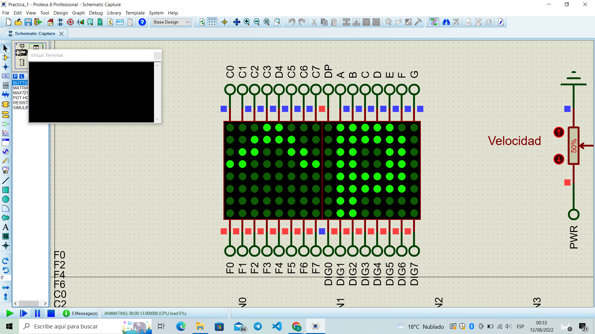

Cabe mencionar que el desplazamiento de cada letra se realiza de columna en columna y la dirección inicial del desplazamiento es de derecha a izquierda (tal y como se muestra en las imágenes anteriores), pero se puede hacer cambio de la dirección del mensaje cuando se presiones Up/Down; Up establecerá la  dirección hacia la izquierda y Down hacia la derecha, pero el cambio no se mostrará hasta que se presione el botón Start. Dicho mensaje se muestra circularmente, es decir, al presentar el último carácter (según el sentido actual), el mensaje vuelve a iniciar.

Además, la velocidad de desplazamiento de este mensaje es controlada por medio de un potenciómetro.

Salir del mensaje inicial
Para salir del mensaje se debe presionar por 3 segundos el botón Start. Al salir del mensaje llevará a iniciar el juego.

### **Juego Inicial**
este juego es una variación del juego Tetris, el cual consta de ir apilando una serie de bloques generados aleatoriamente de derecha a izquierda e ir sumando puntos por completar columnas llenas de 8 bloques.

#### **Piezas** 
El juego consta de 6 piezas en total.
* 5 piezas formadas por cuatro bloques conexos por al menos uno de sus lados.
* 1 pieza de 1x1 bloques.

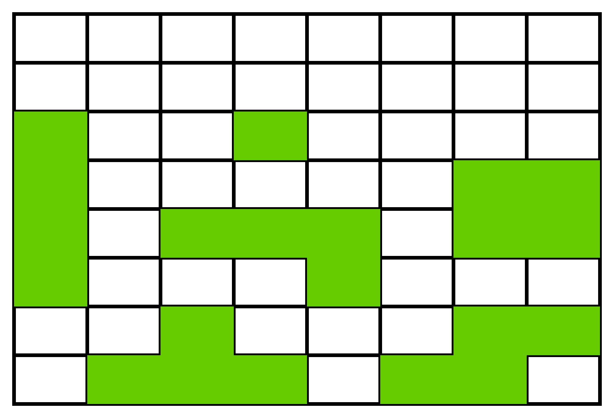

#### **Características de bloques**
Bloque 1x1: este bloque deberá ser representado parpadeante y tiene la propiedad de poder rellenar espacios vacíos que estén bloqueados por otras estructuras previamente formadas, una vez tiene contacto con un bloque continuará su camino sobre dicha columna hasta el bloque vacío más profundo.

Por ejemplo: si el bloque se desplaza y se encuentra en la siguiente posición:

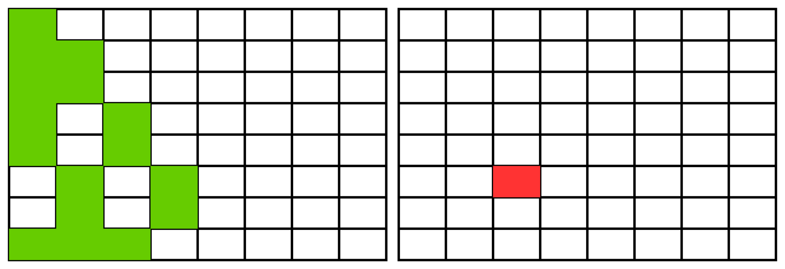

La posición final debería de ser:
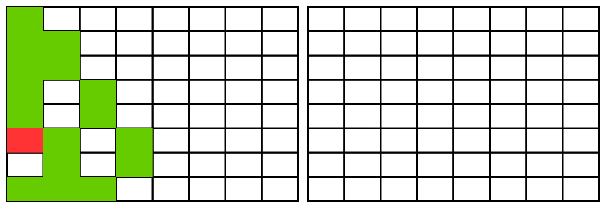

#### **Generación de piezas**
Las piezas son generadas aleatoriamente.

#### **Aparición de piezas** 
Las piezas son generadas de forma “completa” y mostradas inicialmente en la matriz derecha y su posición vertical será aleatoria. Por ejemplo:
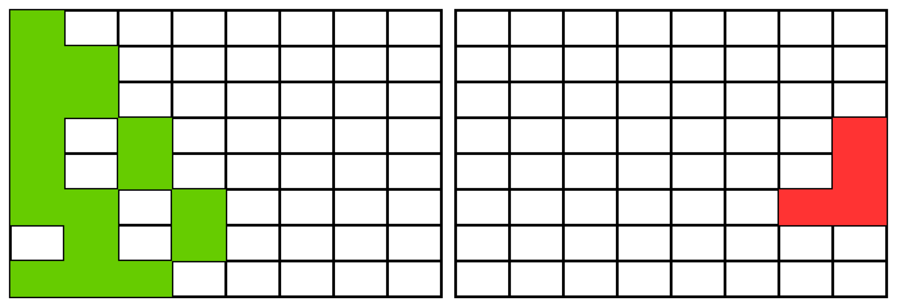

Rotación de piezas
La rotación de piezas será hacia la izquierda para grupos pares. Para la rotación se debe tomar de referencia la columna más a la derecha y la fila superior ocupadas por pieza.
Ejemplo de rotación a la derecha. Por ejemplo:

Orientación inicial de la pieza

Orientación después de hacer una rotación
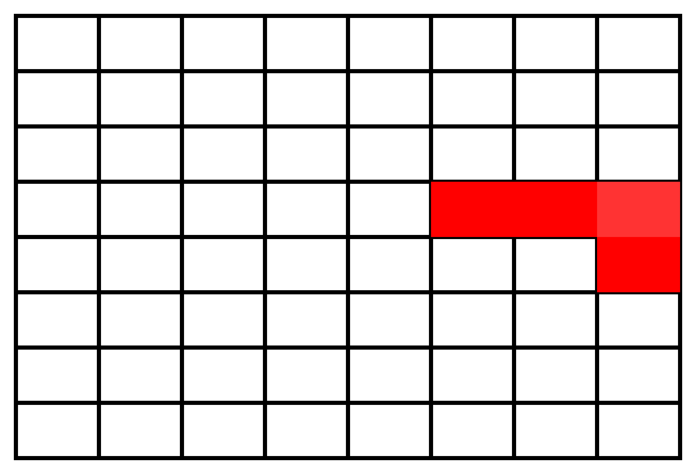

#### **Jugabilidad**
* El juego inicia con ambas matrices vacías
* Estará a la espera de presionar el botón "Start" para que inicie el juego, hasta entonces mostrará la primera pieza.
* Las piezas aparecerán una a una, desde el borde derecho.
* Los botones Up y Down moverán un espacio la pieza cada vez que sea presionado uno de esos botones.
* El botón "Rotate" ejecutará la rotación de la pieza inmediatamente, si la velocidad es muy lenta se pueden hacer varias rotaciones antes que la pieza haga scroll hacia la siguiente columna.
* Las piezas deben ir moviéndose, columna a columna, hacia la izquierda a un ritmo constante.
* La velocidad, que será controlada desde el potenciómetro, aumentará o disminuirá el tiempo que transcurre entre cada paso de scroll.
* Al llegar la pieza a la última columna de la izquierda o tener contacto con otra estructura ya establecida se fijará en esa posición y se suplirá una nueva pieza para continuar el juego.
* Si antes de tener contacto con la estructura fija se presiona el botón "Push" esta mostrará un scroll, más rápido que la velocidad de juego pero visible de la pieza que la unirá con la estructura fija, no permitirá más rotaciones ni movimientos hacia arriba o abajo durante su trayecto.

#### **Puntos** 
Se suma un punto por cada columna de 8 bloques completada, además de tener que eliminar la línea de la visualización y se debe correr hacia la izquierda cualquier estructura a la derecha que no haya sido
eliminada hasta tener contacto con las columnas restantes o la primera columna de la izquierda. Por ejemplo:

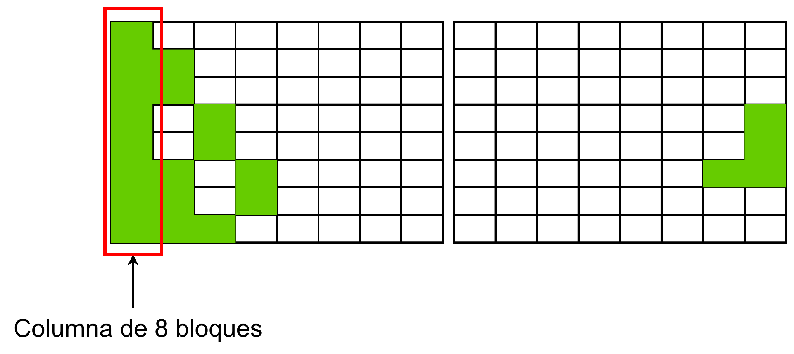

Se suma un punto y se elimina la columna y se corren todas las columnas de la derecha, una posición a la izquierda.

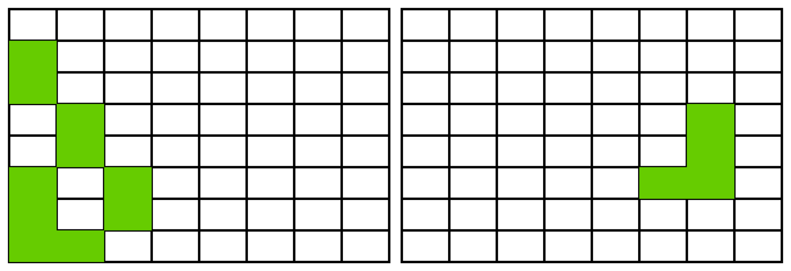

#### **Finalizar Juego** 
El juego termina cuando ya no hay espacio horizontal para más piezas.
Por ejemplo, el juego terminaría:

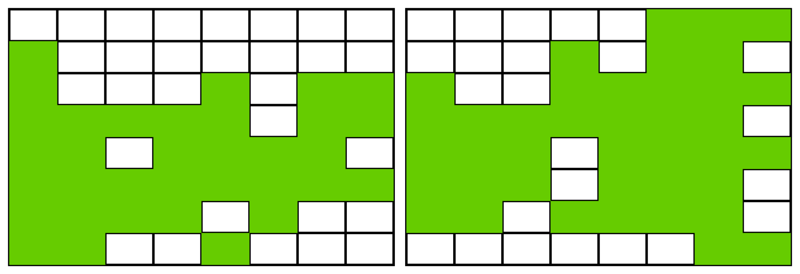

Luego de alcanzar este estado se debe mostrar los puntos obtenidos y quedará en espera que se pulse "Start" para regresar al mensaje inicial.
Menú de Pausa: se entra a este menú presionando el botón Start/Push durante 3 segundos y con el cual se pueden visualizar los puntos acumulados y ver la siguiente pieza a mostrar. Además que permitirá regresar al mensaje (si se mantiene presionado por 2 segundos el botón Start/Push), reanudar el juego (si se mantiene presionado por 3 segundos el botón Start/Push) o reiniciar el juego (si se mantiene presionado por 4 segundos el botón Start/Push). Adicional a lo anterior, si se presiona por más de 5 segundos el botón "Start" Mostrará "EE", un carácter en cada matriz, y quedará esperando a que se pulse el botón "Start" para volver a mostrar el estado de las matrices previo al error.

Cuando se encuentra en este menú y se presiona el botón Start/Push, se intercambia lo que se está visualizando en la pantalla, es decir, si se están visualizando los puntos y se presiona Start/Push, se mostraría ya no el puntaje, si no que la siguiente pieza que se va a generar. Por ejemplo,

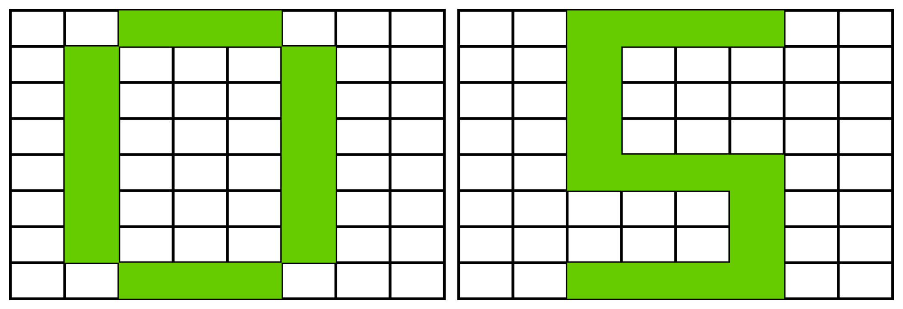

Siguiente pieza a mostrar

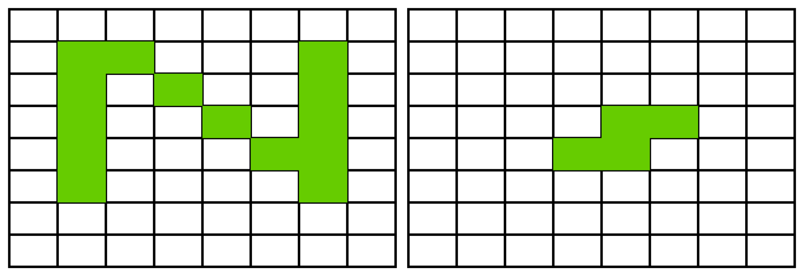

## Componentes usados para jugabilidad

* 4 botones
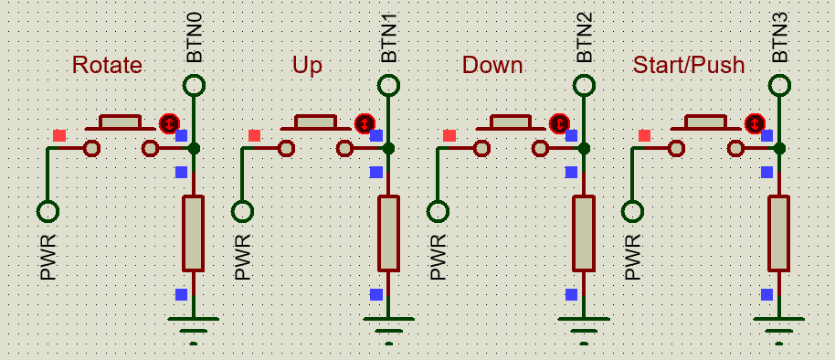

* 2 matrices led de 8x8
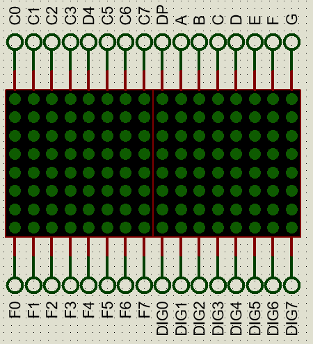

* 1 potenciometro  
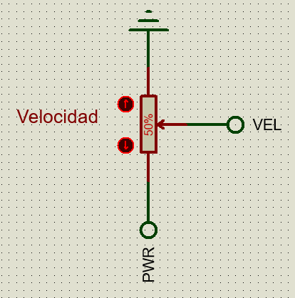
